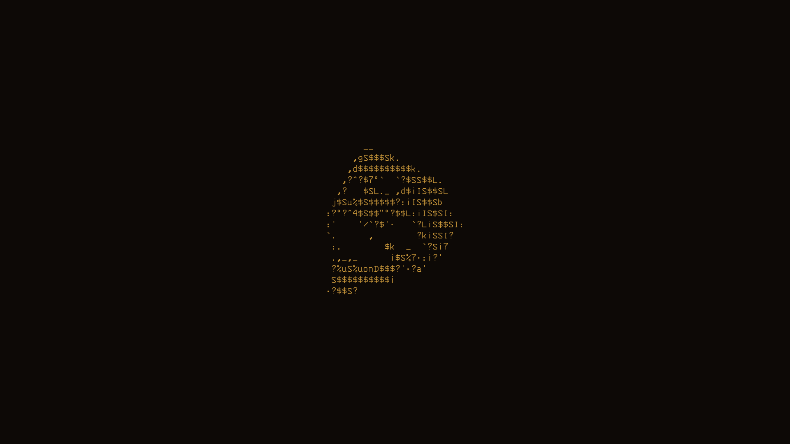

<div align="center">

# 🟠 Avalon Amber

*A Void Linux + Hyprland rice, tuned for the warm phosphor glow of an old amber CRT.*




</div>

## What is this?

This is the [chezmoi](https://www.chezmoi.io)-managed source of truth for my personal
Void Linux desktop — every dotfile, Hyprland config, helper script, and the wallpaper
that ties it together, all in one place, one `chezmoi apply` away from a fresh machine.

The whole thing is built around **amber**: a warm, low-blue-light accent color
(`#c9973a` active / `#4a3823` inactive borders) and a genuine CRT-phosphor screen
shader (`hypr/shaders/avalon-crt.frag`) — the goal was a desktop that looks like it's
running on an old amber monochrome monitor, not a modern flat-design showcase.

## At a glance

| | |
|---|---|
| **OS** | Void Linux (rolling, `xbps`) |
| **Kernel** | Linux (`linux6.18` series) |
| **WM** | [Hyprland](https://hyprland.org) (Wayland) |
| **Init** | runit (no systemd) |
| **Shell** | zsh + [starship](https://starship.rs) prompt |
| **Terminal** | [kitty](https://sw.kovidgoyal.net/kitty/) |
| **Multiplexer** | [zellij](https://zellij.dev) |
| **Editor** | [Helix](https://helix-editor.com); [VS Code](https://code.visualstudio.com) (Void's `vscode` package is actually Code - OSS) for a minimal, fully amber-themed IDE setup |
| **Bar** | [waybar](https://github.com/Alexays/Waybar) |
| **Launcher** | [wofi](https://sr.ht/~scoopta/wofi/) |
| **Notifications** | [dunst](https://dunst-project.org) |
| **Lock/logout** | hyprlock / wlogout |
| **Browser** | [qutebrowser](https://qutebrowser.org) |
| **Fetch tool** | [fastfetch](https://github.com/fastfetch-cli/fastfetch) |
| **Sysinfo** | bluetuith, ncspot |
| **Secrets** | [rbw](https://github.com/doy/rbw) (Bitwarden CLI), SSH commit signing |

## Layout

```
.
├── dot_config/          # -> ~/.config  (hypr, waybar, kitty, helix, dunst, ...)
├── dot_local/
│   ├── bin/             # -> ~/.local/bin  — system-*.sh bootstrap/maintenance/diagnostic suite
│   └── share/           # -> ~/.local/share  (flatpak overrides, etc.)
├── dot_gitconfig        # -> ~/.gitconfig — SSH commit signing, aliases
├── dot_zshrc            # -> ~/.zshrc
├── root-overlay/        # root-owned files outside $HOME chezmoi can't apply directly
│                        # (GRUB theme, greetd config, VS Code's title-bar icon) — backed
│                        # up here, restored by system-setup.sh
├── Pictures/wallpaper/  # -> ~/Pictures/wallpaper  — the amber wallpaper itself
└── LICENSE, README.md   # not applied to $HOME — chezmoi ignores these by convention
```

The `dot_local/bin` scripts are a small, hand-rolled system-maintenance toolkit written
for this machine specifically — real `set -euo pipefail` bash, not toy shell scripts,
sharing common logging/exit-code conventions from `system-lib.sh`:
- `system-setup.sh` — bootstraps a fresh Void install back up to this exact machine:
  packages, repos, services, locale/hostname/groups/cron, the `root-overlay/` restores
  above, and finally `chezmoi apply` itself. Idempotent, safe to re-run.
- `system-update.sh`, `system-health-check.sh`, `system-periodic-maintenance.sh` —
  ongoing maintenance/diagnostics for an already-set-up machine.

## Shell aliases

Most of `dot_zshrc`'s aliases are self-explanatory shortcuts or novelty (`starwars`,
`chucknorris`, `mapscii`, ...) — the ones worth calling out on their own:

- **`cm`/`cma`/`cmd`/`cme`/`cms`/`cmu`/`cmcd`** — chezmoi shortcuts (`chezmoi`,
  `apply`, `diff`, `edit`, `status`, `update`, `cd`). Omz's `chezmoi` plugin only adds
  completion, not aliases, so these are hand-rolled.
- **`ask`** / **`probe`** — stateless, tool-free Claude Code invocations for Unix
  pipes (e.g. `git diff | ask "write a commit message"`). Both use
  `--no-session-persistence` (no transcript saved, nothing resumable) and `--tools=""`
  (no tool calls possible — pure text in, text out, no side effects). They differ only
  in auth/cost: `ask` uses the OAuth login against the Pro subscription; `probe` adds
  `--bare` (faster, fully isolated from hooks/CLAUDE.md/project context) at the cost of
  requiring an `ANTHROPIC_API_KEY` (`--bare` never reads OAuth), pulled from the
  `rbw`-managed Bitwarden vault at call time and billed against Console prepaid credit
  instead of the subscription.
- **`unlock-vault`** / **`unlock-ssh`** — `rbw unlock` / `ssh-add ~/.ssh/id_ed25519`.
  Both prompt for a passphrase interactively, so only run these directly in a real
  terminal — `probe` needs the former, signed commits need the latter.

## Install

```sh
sh -c "$(curl -fsLS get.chezmoi.io)" -- init --apply marc-0x01/avalon-amber
```

This will symlink/copy everything into place under `$HOME`. Some pieces (SSH signing
keys, `rbw` unlock, GitHub auth) are intentionally **not** part of this repo — see below.

## What's *not* here

This repo has been scanned before every push and contains **no secrets**: no private
keys, tokens, password-manager exports, or session data. Chezmoi's `private_*` filename
convention is used throughout (it sets restrictive `0600` permissions on apply), but
that's a permissions hint, not a git-level guarantee — every `private_*` file here has
been manually reviewed and only ever holds ordinary preferences (theme settings, CLI
config), never credentials. Machine-specific secrets (SSH keys, the Bitwarden vault,
`gh`/API tokens) live outside this repo entirely, where they belong.

## License

MIT — see [LICENSE](LICENSE). Take whatever's useful, no attribution required.
